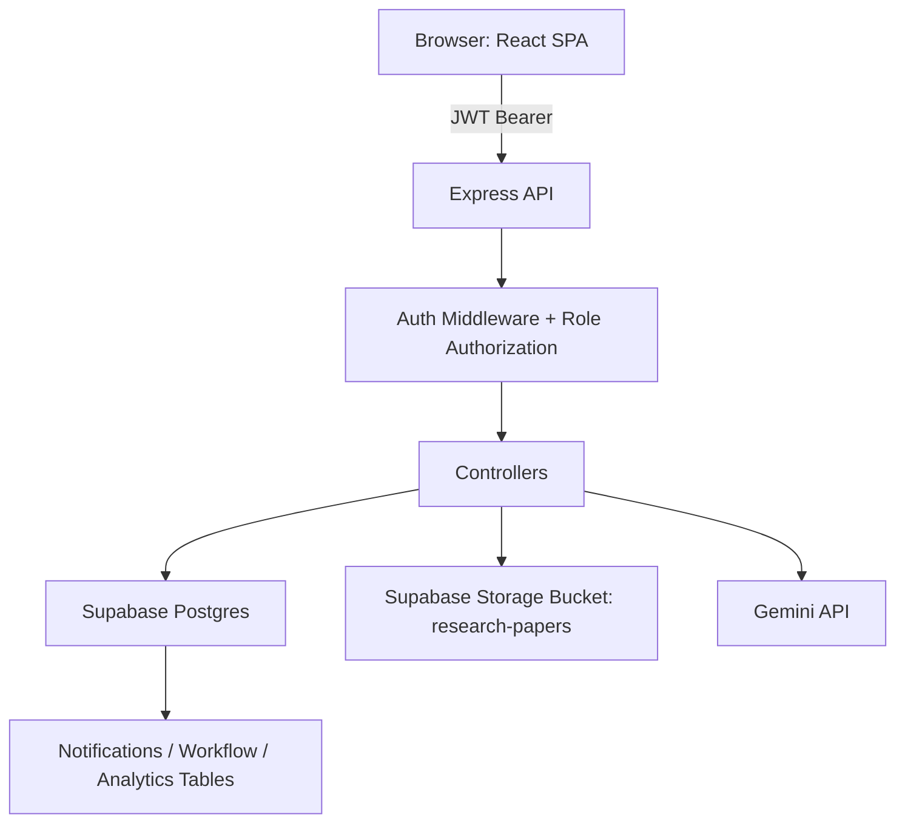

# Context: Capstone Research Repository Management System

## 1. System Overview

### 1.1 What this system is
This application is a multi-role academic research repository and workflow engine. It manages the full lifecycle of student research papers:
- submission
- adviser review
- dean or program chair review
- staff editorial review
- admin final approval/publishing
- repository discovery, viewing, and download analytics
- optional AI-assisted paper Q&A and metadata extraction

### 1.2 Primary users and roles
The system enforces six roles in both UI navigation and API middleware:
- student
- faculty (adviser)
- dean
- program_chair
- staff (research editor)
- admin

### 1.3 High-level responsibilities by role
- student: submit papers, revise when requested, browse approved/published papers
- faculty: review assigned submissions first, then route to dean/program chair
- dean/program_chair: second-stage review, can approve/reject/request revision
- dean: can also perform bypass approval and access monitoring/audit pages
- staff: editorial stage review before admin
- admin: global management (users, papers, publish/unpublish, analytics)

## 2. Technology Stack

### 2.1 Frontend
- React 19 + Vite
- React Router
- Tailwind CSS
- Axios + Fetch (AI API calls use fetch)
- react-pdf for in-app secure PDF viewing
- Framer Motion and Lucide icons
- Supabase JS client for realtime notifications subscription

### 2.2 Backend
- Node.js + Express 5
- Supabase PostgreSQL + Storage
- JWT auth (`jsonwebtoken`) + password hashing (`bcryptjs`)
- Multer for PDF upload handling (memory storage)
- Google Gemini via `@google/generative-ai`
- `pdf-parse` for server-side extraction

### 2.3 Testing
- Backend: Jest + Supertest-style controller/middleware tests
- Frontend: Vitest + Testing Library setup present

## 3. Codebase Structure

## 3.1 Root
- `backend/`: API, workflow, DB access, middleware, tests
- `frontend/`: SPA, role-based pages, route guards, PDF/AI UX
- `backend/migrations/`: SQL schema and evolution scripts

### 3.2 Backend core modules
- `backend/src/server.js`: app bootstrap, CORS, JSON parser, route mounting, error handler
- `backend/src/routes/*.routes.js`: endpoint surface and role guards
- `backend/src/controllers/*.controller.js`: domain logic
- `backend/src/middleware/auth.middleware.js`: JWT auth + role authorization
- `backend/src/middleware/rateLimiter.js`: in-memory auth throttling middleware
- `backend/src/config/supabase.js`: Supabase client + storage helpers
- `backend/src/config/gemini.js`: Gemini model setup
- `backend/src/utils/*.js`: workflow policy, file access, cache, standardized responses, names, audit log helper

### 3.3 Frontend core modules
- `frontend/src/App.jsx`: route tree and role-gated page composition
- `frontend/src/contexts/AuthContext.jsx`: auth session lifecycle
- `frontend/src/utils/api.js`: API client map by domain
- `frontend/src/components/auth/ProtectedRoute.jsx`: route-level guard
- `frontend/src/components/layout/Sidebar.jsx`: role-specific navigation + unread/pending badges
- `frontend/src/components/pdf/SecurePDFViewer.jsx`: PDF viewing, watermarking, anti-copy behavior, annotation UX
- `frontend/src/components/ai/ResearchChat.jsx`: side-panel AI assistant chat on paper detail screens
- `frontend/src/components/ErrorBoundary.jsx`: fallback UI for runtime crashes

## 4. Runtime Architecture

### 4.1 Request flow
1. User authenticates via `/api/auth/login`.
2. Backend issues JWT (7-day expiry) with role claim.
3. Frontend stores token in sessionStorage.
4. Protected frontend routes call API with bearer token.
5. Backend middleware verifies token and checks role.
6. Controllers execute workflow/data operations in Supabase.
7. Notifications and audit/workflow history are persisted.

## 5. Backend API Architecture

### 5.1 Route groups
- `/api/auth`
- `/api/research`
- `/api/ai`
- `/api/departments`

### 5.2 Auth routes (`auth.routes.js`)
Public:
- POST `/register` (with auth rate limiter)
- POST `/login` (with auth rate limiter)

Protected:
- GET `/me`
- GET `/notifications`
- GET `/notifications/unread-count`
- PATCH `/notifications/:id/read`
- PATCH `/notifications/read-all`
- GET `/students/search`

Admin-only:
- GET `/users`
- DELETE `/users/:id`
- POST `/users/create`

### 5.3 Research routes (`research.routes.js`)
Public:
- GET `/published`
- GET `/categories`

Authenticated and role-scoped examples:
- GET `/dean-chair/members` (faculty)
- GET `/faculty/members` (authenticated)
- GET `/dean/activity-monitor` (dean)
- GET `/dean/audit-logs` (dean)
- GET `/profile/data` (authenticated)
- GET/POST/DELETE `/:id/annotations...` (authenticated, privileged for writes)
- GET `/:id/file`, GET `/:id`, POST `/:id/view`, POST `/:id/download`
- POST `/submit` (student/staff/admin)
- GET `/my/papers` (student/staff/admin)
- GET `/all/papers` (staff/admin)
- POST `/:id/approve|reject|revision` (review roles)
- GET `/faculty/assigned` (faculty)
- GET `/dean-chair/assigned` (dean/program_chair)
- Admin CRUD + publish routes under `/admin/...`
- POST `/:id/dean-bypass` (dean)

### 5.4 AI routes (`ai.routes.js`)
- POST `/chat` (authenticated + in-memory AI limiter)
- POST `/extract-pdf` (authenticated + limiter + PDF upload)

### 5.5 Department routes (`department.routes.js`)
Public:
- GET `/`
- GET `/:id/programs`

Admin:
- POST/PUT/DELETE department
- POST/PUT/DELETE program

## 6. Workflow Engine (Core Business Logic)

### 6.1 Workflow statuses
The paper lifecycle uses these statuses:
- `pending` (legacy)
- `pending_faculty`
- `pending_dean`
- `pending_program_chair`
- `pending_editor`
- `pending_admin`
- `revision_required`
- `rejected`
- `approved`
- `published`
- legacy compatibility values (`under_review`, `faculty_approved`, `editor_approved`)

### 6.2 Standard approval flow
1. student submits paper.
2. If adviser assigned, status is `pending_faculty`.
3. faculty approves and must choose target reviewer:
- target dean -> `pending_dean`
- target program chair -> `pending_program_chair`
4. dean/program_chair approves -> `pending_editor`.
5. staff approves -> `pending_admin`.
6. admin approves -> `approved` (with published date set).

### 6.3 Rejection flow
At any valid stage, reviewer can reject with reason:
- status -> `rejected`
- workflow event written to `approval_workflow`
- audit event logged

### 6.4 Revision flow
Revision behavior depends on who requested it:
- faculty/dean/program_chair request: status -> `revision_required` for student
- staff request: paper returns to stage-2 reviewer if assigned, else faculty
- admin request: paper returns to `pending_editor`

On student resubmission from `revision_required`, controller uses `last_reviewer_role` and `previous_status` to route it back to correct stage.

### 6.5 Dean bypass flow
Dean can bypass normal sequencing:
- endpoint: POST `/:id/dean-bypass`
- allowed target statuses include `pending_dean`, `pending_editor`, `pending_admin`, `approved`
- blocked for finalized papers (`approved`, `published`, `rejected`)
- writes bypass metadata and audit log

## 7. Access Control Model

### 7.1 API-level controls
- JWT verification in `authenticate`
- role checks in `authorize(...roles)`
- resource-level checks for paper access in `canAccessPaper`

### 7.2 Paper access rules (`canAccessPaper`)
Access is allowed when:
- paper is public (`approved` or `published`)
- requester is author
- requester is assigned faculty
- requester is assigned dean/program chair
- requester role is admin or staff

### 7.3 Frontend-level controls
- `ProtectedRoute` blocks unauthenticated users
- `allowedRoles` blocks wrong-role navigation
- `DashboardRouter` redirects each role to appropriate dashboard

## 8. File and Storage Architecture

### 8.1 Upload path
- Multer stores PDF in memory
- backend uploads to Supabase storage bucket `research-papers`
- file path pattern: `userId/uuid.ext`

### 8.2 URL strategy
- public papers: use stored `file_url`
- non-public papers: resolve signed URL from `file_storage_path`
- fallback supports legacy rows that only have URLs

### 8.3 File retrieval endpoint
- GET `/api/research/:id/file`
- returns `fileUrl`, signed/public flag, source metadata

## 9. AI Subsystem

### 9.1 AI chat with a paper
Flow:
1. client sends `paperId` + user question
2. backend validates access to paper
3. backend resolves file URL
4. backend downloads PDF bytes with axios
5. backend extracts text via `pdf-parse`
6. backend builds constrained prompt
7. Gemini generates response
8. response returned to client

### 9.2 PDF metadata extraction
- uploaded PDF is parsed
- prompt asks Gemini for strict JSON title + abstract
- parser attempts JSON cleanup/recovery if model format deviates

### 9.3 AI rate limiting
In-memory bucket keyed by user+IP with env-configurable window and max requests.

## 10. Notification and Activity Architecture

### 10.1 Notifications
- notifications created during submission/approval/revision/publish events
- user can list notifications, get unread count, mark one/all as read
- sidebar polls notifications and also subscribes to Supabase realtime changes

### 10.2 Audit and workflow trails
- `approval_workflow` records review actions across stages
- `audit_logs` captures security/trace events such as approve/reject/revision/bypass
- dean has visibility endpoints for activity monitor and audit logs

## 11. Database Architecture

### 11.1 Core tables
- `users`
- `research_papers`
- `research_authors`
- `research_comments`
- `approval_workflow`
- `notifications`
- `paper_views`
- `paper_downloads`
- `departments`
- `programs`
- `refresh_tokens` (migration exists)
- `audit_logs`

### 11.2 Key relationships
- `research_papers.author_id -> users.id`
- `research_papers.faculty_id -> users.id`
- `research_papers.dean_chair_id -> users.id`
- `research_authors.(research_id, user_id) -> papers/users`
- `approval_workflow.research_id -> research_papers.id`
- `approval_workflow.reviewer_id -> users.id`
- `notifications.user_id -> users.id`
- `notifications.research_id -> research_papers.id`

### 11.3 Performance design
Indexes are present for:
- status and reviewer queues
- author/faculty/dean-chair lookups
- unread notifications
- paper view/download analytics
- audit log querying

## 12. Frontend Architecture in Detail

### 12.1 Route composition
- public: landing, login, register
- protected shell: sidebar + content outlet
- role-specific sections for student/faculty/dean/chair/staff/admin
- shared profile and notifications pages

### 12.2 Role dashboards/pages inventory
- student: dashboard, my research, submit, browse, detail
- faculty: dashboard, review queue/detail, repository
- dean/chair: dashboard, review queue/detail, repository
- dean-only: activity monitor, audit logs
- staff: dashboard, review queue/detail, repository
- admin: dashboard, paper management, user management, analytics

### 12.3 Secure PDF viewer behavior
- watermark overlay
- optional anti-copy keyboard interception when annotation mode disabled
- right-click disabled
- annotation modes: highlight, sticky note, selection
- page/zoom/fullscreen controls

### 12.4 Error handling
- frontend has `ErrorBoundary` component and test coverage for it
- app-level integration of boundary wrapping should be verified per route tree usage

## 13. Authentication and Session Lifecycle

### 13.1 Registration and login
- registration normalizes email to lowercase
- login also normalizes email
- backend signs JWT with role/id/email claims

### 13.2 Session persistence
- frontend stores token in sessionStorage and removes legacy localStorage token
- API client adds `Authorization: Bearer <token>` on each request

## 14. Existing Safeguards and Security Posture (Current Code)

Implemented safeguards:
- role-based access checks on protected routes
- auth endpoint rate limiter middleware on register/login
- AI endpoint rate limiter
- file type and size constraints for uploads
- signed URL strategy for non-public files

Important gaps still visible in current backend bootstrap:
- no Helmet security headers in `server.js`
- startup validation for `JWT_SECRET` strength not implemented
- multiple debug `console.log` in AI and other controllers

## 15. Test Landscape (Current Repository)

Backend tests present:
- auth controller
- ai access
- research workflow
- auth middleware
- rate limiter
- file access utility
- workflow policy utility

Frontend tests present:
- ErrorBoundary test + test setup

This is no longer a near-zero test repository; a foundational automated test suite now exists.

## 16. Deployment and Operations Notes

### 16.1 Backend scripts
- `npm run dev` for local server
- `npm test` for backend tests
- `npm run backfill:storage-path` for migration support script

### 16.2 Frontend scripts
- `npm run dev`
- `npm run build`
- `npm test` and `npm run test:coverage`

### 16.3 Environment-driven behavior
Examples of env-driven knobs:
- `PORT`, `CORS_ORIGINS`, `TRUST_PROXY`
- `JWT_SECRET`
- Supabase URL/keys and storage bucket
- AI limiter window/max
- signed URL TTL

## 17. End-to-End Sequence Summaries

### 17.1 Student submission to publication
1. student uploads PDF and metadata.
2. record saved to `research_papers` + storage file uploaded.
3. assigned reviewers notified.
4. paper moves through stage statuses.
5. final admin approval marks approved/published.
6. published paper appears in public browse endpoint.

### 17.2 Reviewer action sequence
1. reviewer opens assigned queue endpoint.
2. reviewer opens paper detail/file endpoint.
3. reviewer acts: approve/reject/revision.
4. controller validates role-status transition.
5. status updates + notifications + audit/workflow inserts happen.

### 17.3 AI-assisted reading sequence
1. authorized user opens paper detail.
2. chat request sent with `paperId` and question.
3. backend verifies access and processes PDF.
4. Gemini response returned and rendered in side assistant panel.

## 18. Known Integration Nuances

- Frontend API helper currently contains `deanInterveneResearch` mapped to `/research/:id/dean-intervene`, while backend route is `/research/:id/dean-bypass`.
- Frontend also exposes `deanBypassApprove`, but payload keys should match backend expectations (`reason`, `targetStatus`).
- Some comments/doc lines in SQL files reflect historical state and may not always match latest code behavior; operational truth should prefer active controllers/routes.

## 19. Practical Mental Model

Treat this system as three engines working together:
1. Workflow engine: role/status transition logic (`review.controller.js` + `workflowPolicy.js`).
2. Repository engine: paper CRUD, storage access, analytics tracking (`submission.controller.js`, `admin.controller.js`).
3. Collaboration/intelligence engine: annotations, notifications, audit trails, and AI assistant (`annotation.controller.js`, `notification.controller.js`, `ai.controller.js`).

That combination makes the platform both a controlled publication pipeline and an interactive research repository.
